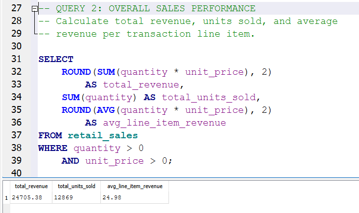
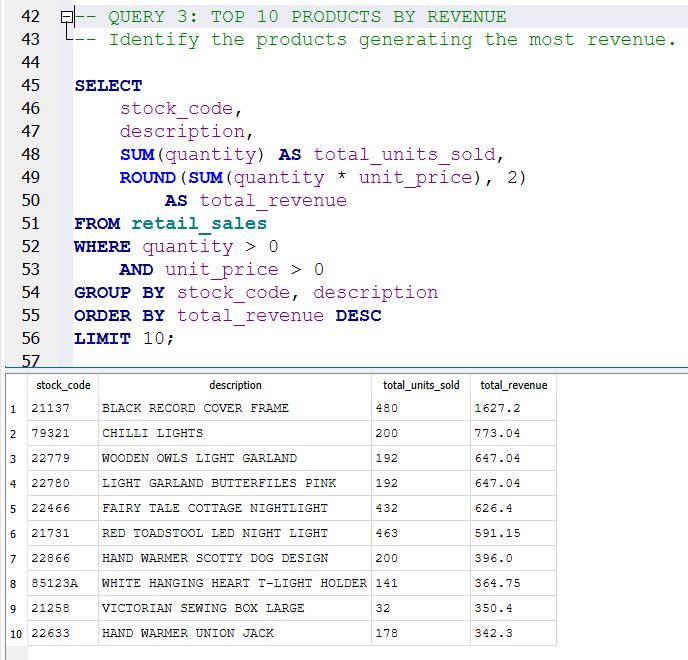
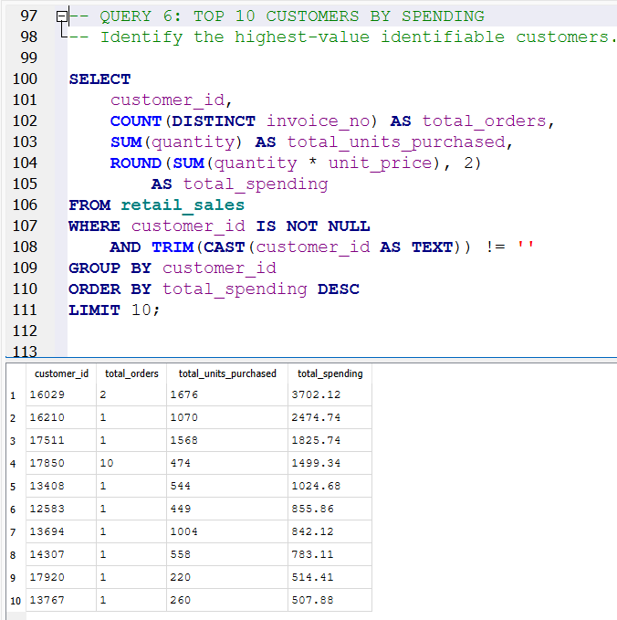
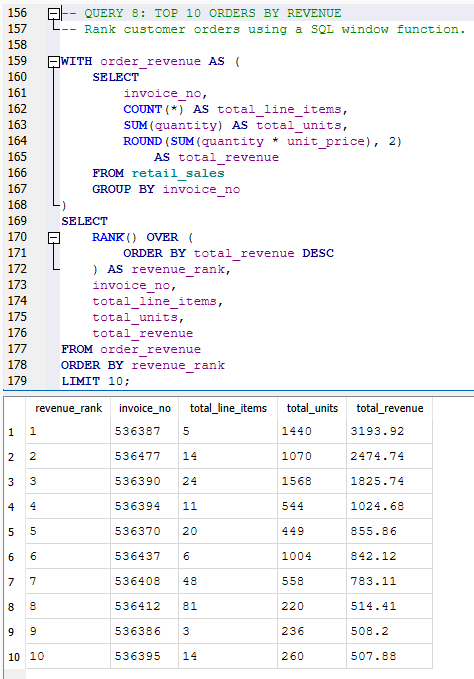

# Retail Sales Performance SQL Analysis

## Project Overview

Analyzed 989 retail transaction records from the UCI Online Retail dataset using SQLite and DB Browser for SQLite. The project evaluates sales revenue, product performance, customer purchasing behavior, geographic distribution, and order-level profitability metrics.

**Tools:** SQLite, SQL, DB Browser for SQLite, Microsoft Excel

**SQL Skills:** Aggregations, GROUP BY, CTEs, window functions, date formatting, subqueries, and filtering.

## Key Findings

- **Total Revenue:** £24,705.38 across 61 orders.
- **Units Sold:** 12,869.
- **Average Order Value:** £405.01.
- **Top Product:** Black Record Cover Frame, generating £1,627.20.
- **Leading Market:** United Kingdom, contributing 94.31% of revenue.
- **Top Identifiable Customer:** Customer 16029, generating £3,702.12 across two orders.
- **Highest-Value Order:** Invoice 536387, generating £3,193.92 from 1,440 units.

## SQL Analysis

The project includes eight SQL queries covering:

1. Dataset overview and transaction counts
2. Overall revenue and sales performance
3. Top 10 products by revenue
4. Geographic revenue distribution
5. Average order value
6. Top 10 customers by spending
7. Daily sales performance
8. Top 10 orders ranked using SQL window functions

## Methodology

1. Downloaded the UCI Online Retail dataset.
2. Cleaned the data in Excel by removing canceled transactions and records with nonpositive quantities or unit prices.
3. Selected a sample of 989 transaction line items.
4. Imported the cleaned CSV into SQLite.
5. Developed and validated eight SQL queries to analyze business performance.

**Dataset limitation:** The sample contains transactions from December 1, 2010, so findings represent a single day rather than long-term retail performance. Customer rankings exclude transactions without identifiable customer IDs.

## Project Files

- `Retail_Sales_Analysis.db` — SQLite database
- `Retail_Sales_Cleaned.csv` — Cleaned transaction dataset
- `retail_sales_analysis.sql` — Eight documented SQL queries
- `screenshots/` — SQL queries and corresponding results

## Analysis Screenshots

### Overall Sales Performance

### Top Products by Revenue

### Top Customers by Spending

### Order Revenue Rankings

## Data Source

UCI Machine Learning Repository — Online Retail Dataset

https://archive.ics.uci.edu/dataset/352/online+retail

## Business Applications

This analysis demonstrates how SQL can support revenue reporting, customer segmentation, product performance evaluation, and order-level analysis to inform business decisions.
